# Stock Analysis Report

**Tickers:** AAPL, MSFT, GOOGL

**Date range:** 2019-10-01 → 2025-10-11

## Summary Metrics

### AAPL

- Annualized Return: 28.59%

- Volatility: 31.81%

- Sharpe Ratio: 0.87

- Max Drawdown: -33.36%

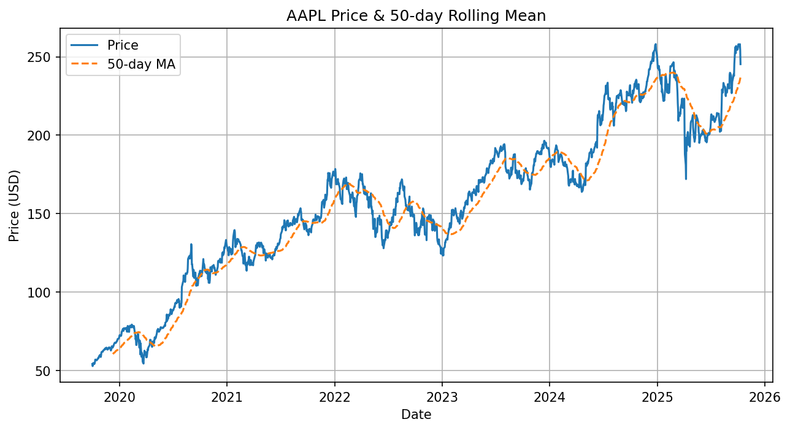

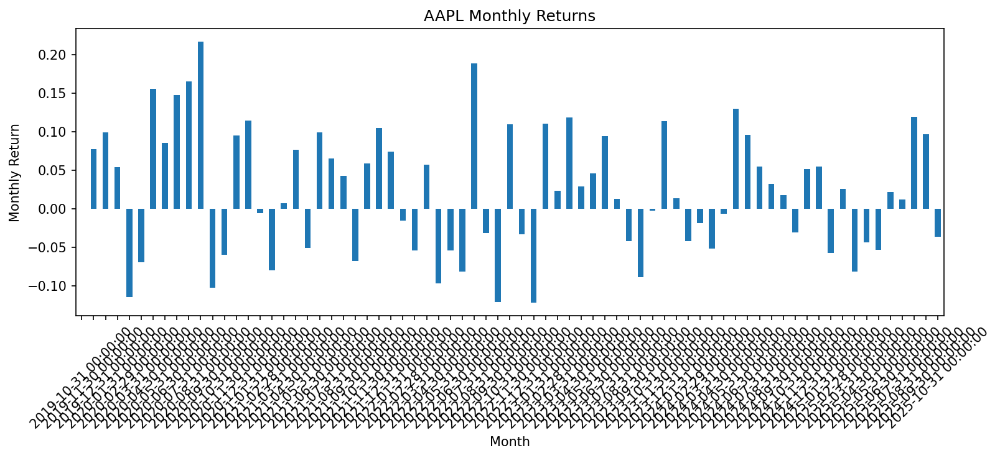

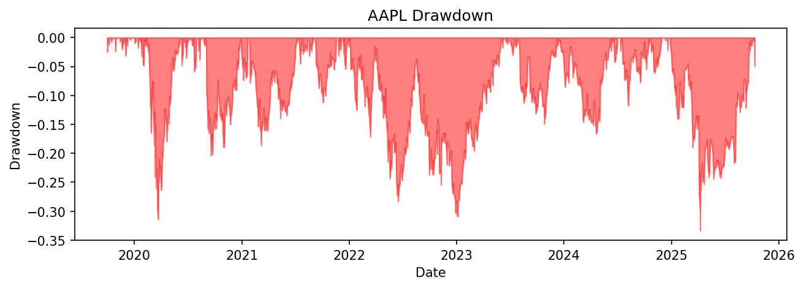

### MSFT

- Annualized Return: 25.58%

- Volatility: 29.39%

- Sharpe Ratio: 0.84

- Max Drawdown: -37.15%

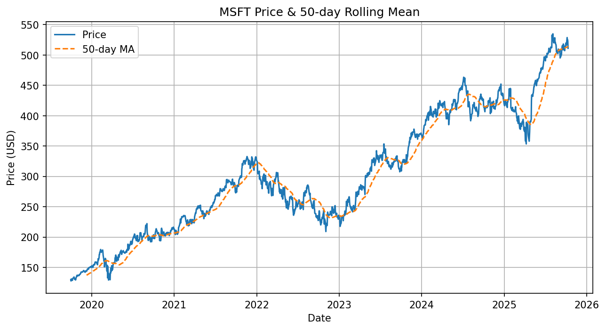

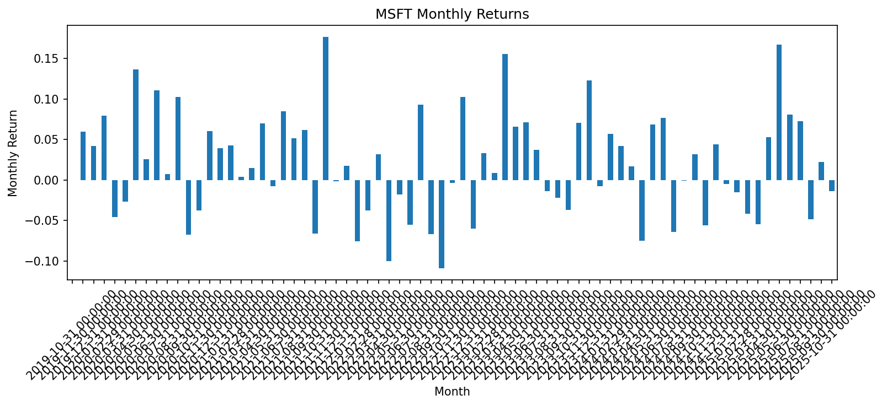

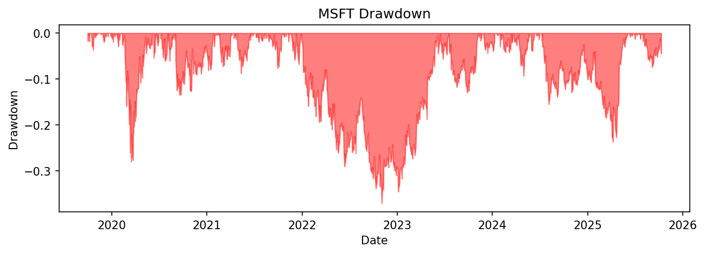

### GOOGL

- Annualized Return: 25.67%

- Volatility: 31.99%

- Sharpe Ratio: 0.77

- Max Drawdown: -44.32%

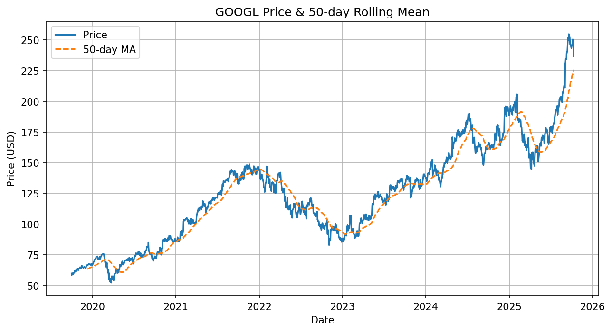

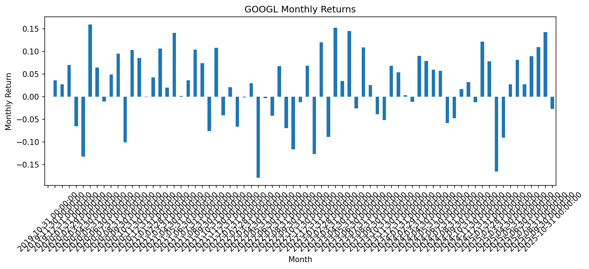

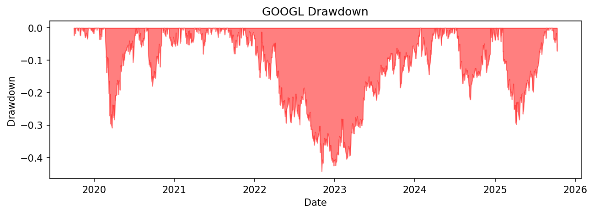

## Cross-Ticker Visuals

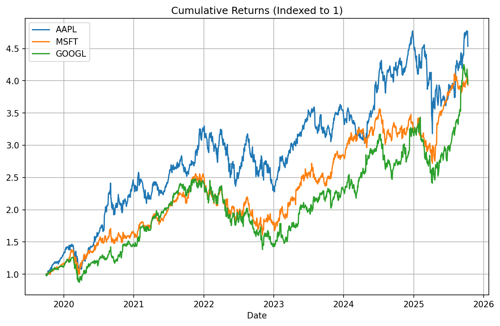

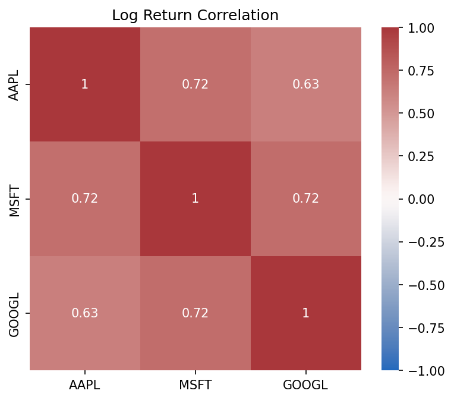
